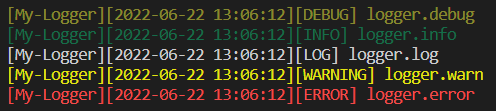

<p align="center">

<a  href="https://github.com/prostojs/logger/blob/main/LICENSE">
    
</a>
    
</p>

Plain simple logger with banner and colors based on `@prostojs/dye`

## Install

npm: `npm install @prostojs/logger`

Via CDN:
```
<script src="https://unpkg.com/@prostojs/dye"></script>
<script src="https://unpkg.com/@prostojs/logger"></script>
```

## Usage

```js
const { dye } = require('@prostojs/dye')
const { ProstoLogger, EProstoLogLevel }  = require('@prostojs/logger')

const logger = new ProstoLogger({
    banner: dye('green')('[Logger]'),
    logLevel: EProstoLogLevel.DEBUG,
})

logger.debug('logger.debug')
logger.info('logger.info')
logger.log('logger.log')
logger.warn('logger.warn')
logger.error('logger.error')
```



### Options

```js
const logger = new ProstoLogger({

    // banner that will be shown next to each message
    // *optional
    banner: dye('green')('[Logger]'),

    // maximum log level that will show message
    // *default EProstoLogLevel.LOG
    logLevel: EProstoLogLevel.DEBUG,

    // console interface (usually `console` itself)
    // *default console
    console: console,

    // styles for each message type
    // *optional
    styles: {
        debug:  dye('yellow-bright', 'dim'),
        info:   dye('green', 'dim'),
        log:    dye(),
        warn:   dye('yellow'),
        error:  dye('red', 'red-bright'),
    },

    // banners for each message type
    // *optional
    typeBanners: {
        debug:  '[ DEBUG ]',
        info:   '[ INFO  ]',
        log:    '[  LOG  ]',
        warn:   dye('bg-yellow', 'red')('[WARNING]'),
        error:  dye('bg-red', 'white')('[ ERROR ]'),
    },
})
```
